# Wallet Stress Test Diagnosis (`atomic03`)

## Test scope

- Operation: `atomic`
- Profile: `discovery`
- Wallets: `1,000`; duplicates: `5%`
- Load: `20 req/s` warm-up, then `+30 req/s` every `90 s` for eight stages
- Database and cache were truncated before each run.

## First test — before the index fix

### What happened?

- Atomic gRPC traffic increased normally, but `complete_ledger_transaction` fell below 10 TPS.
- Completion throughput did not recover promptly after incoming traffic stopped.
- Business and Kafka-listener processing latency remained high, indicating a persistent backlog or downstream bottleneck.

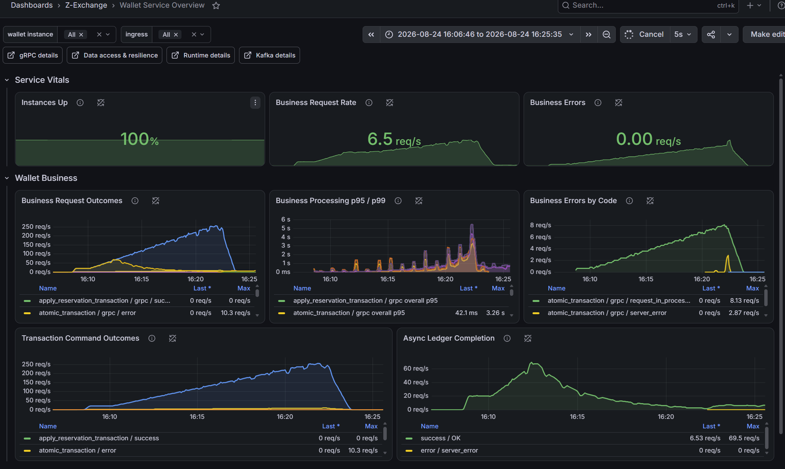

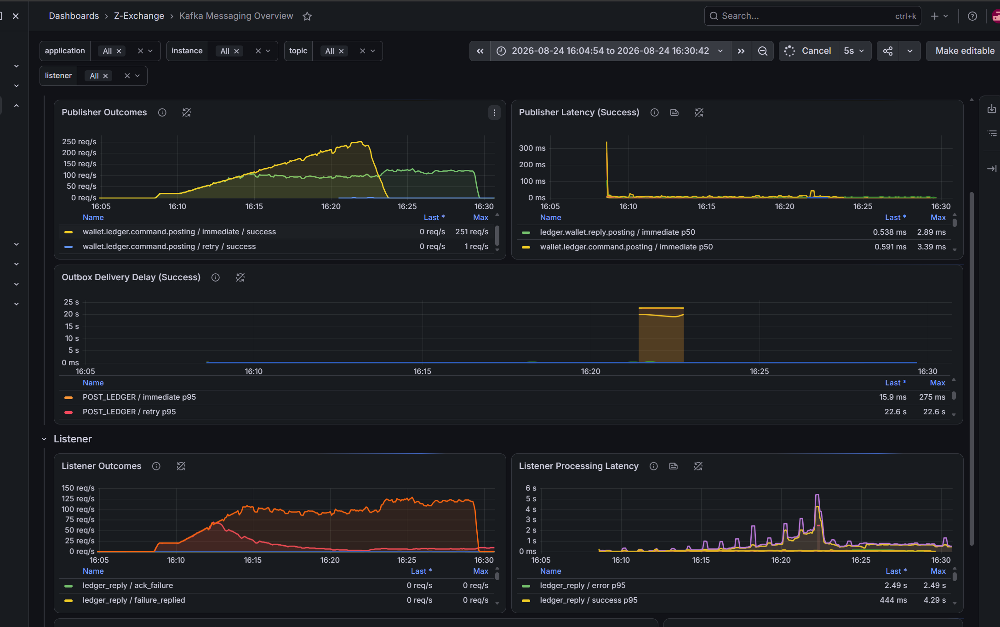

### How was it diagnosed?

1. Compare incoming TPS, completion TPS and business latency on the same timeline.
2. Stop the load and observe recovery. No immediate recovery shows that work remains backlogged; it does **not** by itself rule out saturation.
3. Separate Kafka publisher latency, listener latency and consumer lag. Listener processing latency includes business and database work, so a high value does not prove a Kafka broker problem.
4. Break down database latency by mapper and operation. `WalletReservationMapper.selectList` was the dominant slow operation.
5. Compare its SQL predicate with the table indexes and verify the access path with `EXPLAIN ANALYZE` or slow-query statistics.
6. Use Hikari and host CPU only as supporting evidence of resource pressure.
7. Apply the query/index fix, then repeat the same load against the same data and schema.

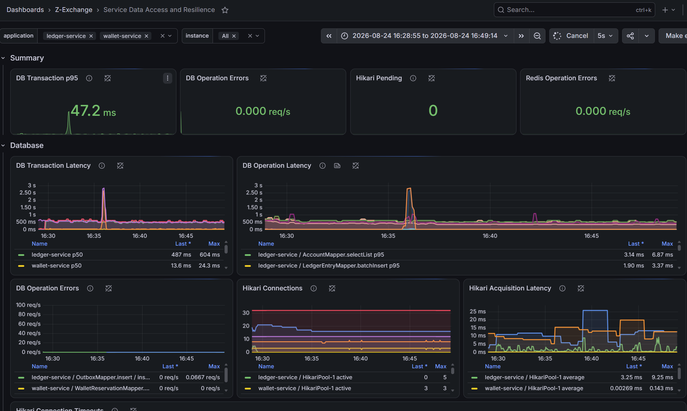

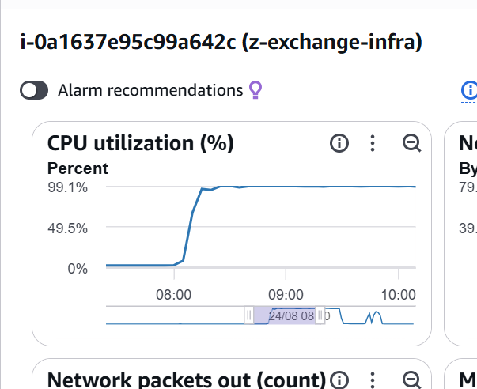

### Where was the problem?

The primary bottleneck was the wallet-reservation lookup. The table had an index on `(initiator, reference_id)`, but `WalletReservationMapper.selectList` filtered only by `reference_id`. Without the leading index column, MySQL could not efficiently seek through that index.

A second index/query mismatch existed in the outbox polling query. Commit `5faac0bc9f1d89a965f39e3cba757ecc17160819` aligned both query patterns with their indexes.

### Conclusion and next step

The first test was limited primarily by an unindexed wallet-reservation access path, with an additional outbox index mismatch. Deploy commit `5faac0b`, apply the required schema migration, and rerun the identical test to verify lower query latency and normal backlog recovery.

## Second test — after the index fix

### What happened?

- Database operation latency was substantially lower than in the first test.
- Completion throughput reached about 120 TPS, then decreased as gRPC throughput continued toward approximately 268 TPS.
- When gRPC traffic stopped, completion throughput recovered to roughly 140–170 TPS and drained the backlog.

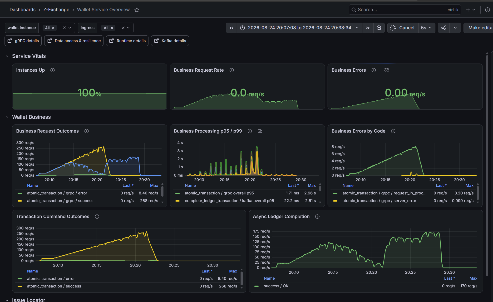

### Was the previous problem solved?

Yes, the evidence strongly indicates that the original slow-query problem is solved:

- DB operation latency remains mostly in the millisecond-to-tens-of-milliseconds range.
- The previous prolonged mapper-latency pattern is absent.
- Completion throughput recovers quickly after foreground traffic stops, unlike the first test.

For strict proof, compare before/after query plans and latency percentiles under the same schema, data volume and load profile.

### How was it diagnosed?

1. Compare database-operation latency with the first run. The large mapper-latency pattern had disappeared, so the index fix was effective.
2. Observe that completion TPS recovered after gRPC traffic stopped. This indicated a new load-dependent bottleneck rather than the previous persistent slow-query problem.
3. Inspect Kafka next. Listener processing latency increased, but this metric includes business and database work, so it did not establish a Kafka broker problem.
4. Correlate the decline with infrastructure CPU above 80%. CPU contention became the initial hypothesis, but host-wide CPU alone could not show which service or operation was constrained.
5. Add wallet-service metrics to the database dashboard. Wallet active connections reached the configured maximum of 12, pending requests spiked, and acquisition latency approached the 2-second timeout while individual SQL operations remained relatively fast.
6. Treat the Hikari limit as the strongest measurable bottleneck and use a larger pool as the next controlled experiment.

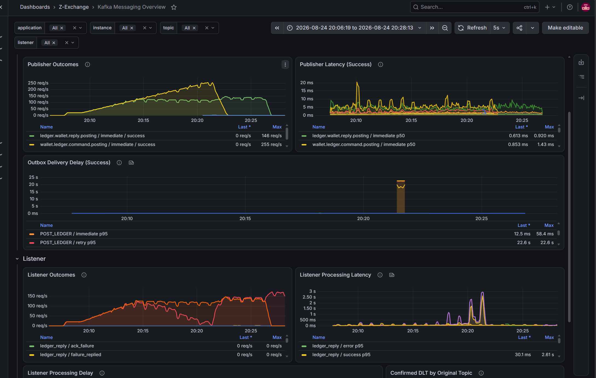

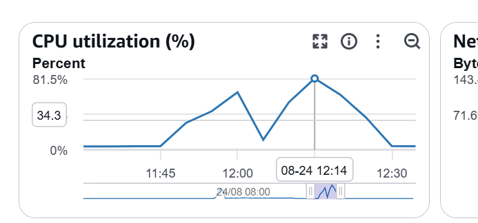

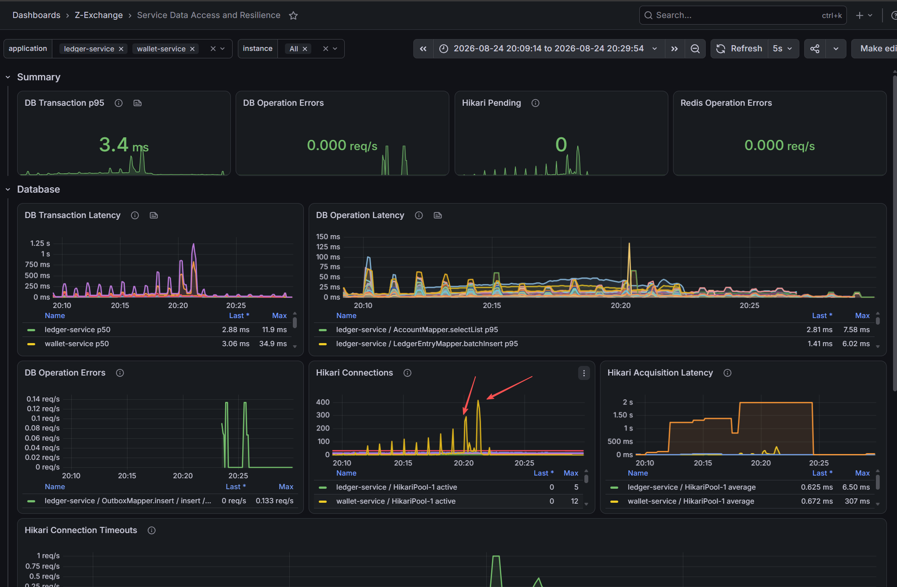

### Where was the new problem?

The evidence located the new bottleneck at wallet connection acquisition rather than SQL execution. The 12-connection pool was exhausted under load, causing pending requests and long acquisition latency.

At this stage, the test had not yet established why completion work was disproportionately affected or that gRPC and Kafka were competing for the same pool. CPU remained a possible contributor; pool exhaustion was the clearest observed constraint.

### Conclusion and next step

The index fix resolved the first bottleneck. The working conclusion from the second run was that the wallet pool maximum of 12 was insufficient for this load. Expanding the pool was intended to test whether connection availability was limiting completion throughput; the shared-pool contention mechanism was not yet proven.

Apply and test the following configuration:

```text
wallet maximumPoolSize = 32
wallet minimumIdle     = 16
MySQL max_connections  = 80
```

Restart the wallet service and recreate the MySQL container so the settings take effect. Rerun the same test and confirm:

- Hikari pending remains near zero;
- acquisition latency and connection timeouts remain low;
- completion TPS does not collapse as gRPC TPS rises;
- Kafka consumer lag stays bounded;
- MySQL CPU, query latency and lock waits remain healthy.

If pending requests remain high with 32 connections, inspect connection holding time and transaction boundaries before increasing the pool again.

## Third test — pushing the expanded pool to saturation

### What happened?

The wallet pool was configured with 32 maximum connections and MySQL with 80. The higher load exposed a clear saturation interval around 02:20–02:24:

- Atomic gRPC success throughput rose to roughly 300 TPS, then stopped scaling; the two dashboards report maxima of about 324–337 TPS because they use different queries and windows.
- `complete_ledger_transaction` initially reached about 115 TPS, declined as gRPC load grew, and eventually stayed at zero during the saturation interval.
- Completion processing p95 reached about 3.89 seconds during overload.
- At the same time, gRPC latency formed a sustained plateau: p95 reached about 3.39 seconds and p99 about 4.29 seconds. Active calls also accumulated.
- gRPC request errors increased, including `request_in_processing` and `server_error` outcomes.
- When foreground traffic stopped, completion throughput immediately recovered to about 139–143 TPS and began draining the backlog.

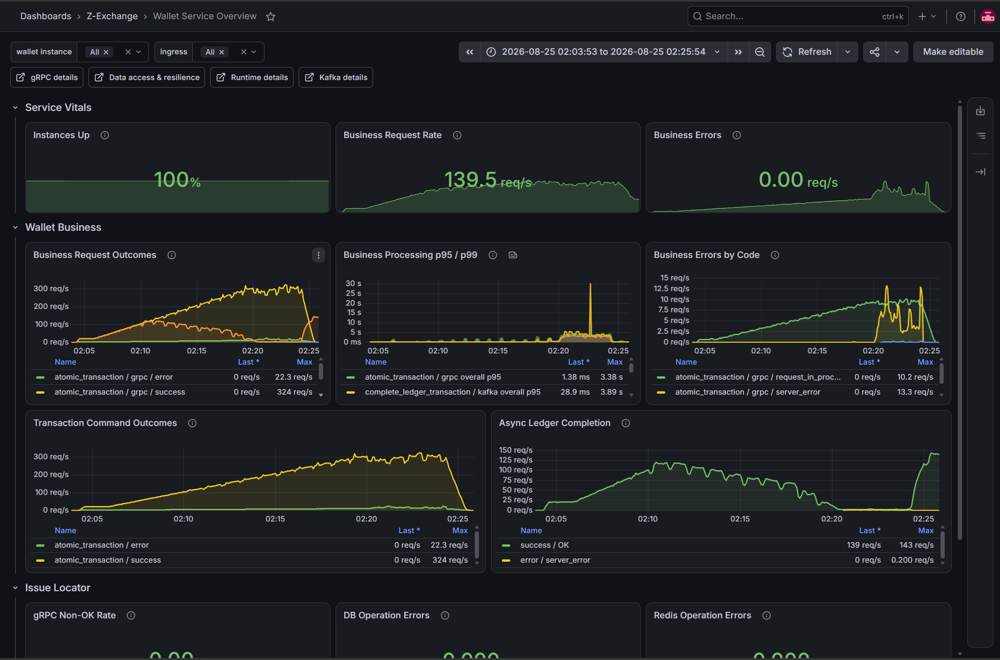

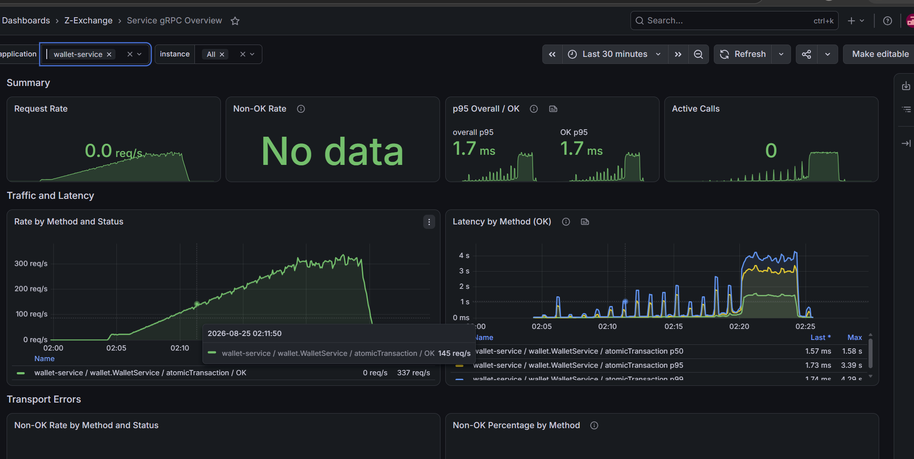

| Phase | gRPC behavior | Completion behavior | Pool behavior |
| --- | --- | --- | --- |
| Ramp-up | TPS rises with offered load | Peaks, then declines | Pending and acquisition latency grow |
| Saturation | TPS plateaus near 300+; latency and errors rise | Successful TPS stays at zero | 32 active connections, about 400+ pending requests, timeouts |
| Drain | Foreground traffic stops | Recovers to about 140 TPS | Pending requests and timeouts collapse |

### Was the previous connection-pool problem solved?

No. The larger pool delayed saturation and increased the achievable gRPC rate, but it was still exhausted:

- Wallet active connections reached the new maximum of 32.
- Pending requests rose to roughly 400–430 and stayed high during the plateau.
- Average acquisition latency reached about 320 ms; maximum acquisition latency reached about 2.10 seconds, matching the configured 2-second timeout boundary.
- Hikari connection timeouts rose to roughly 13 req/s.
- Wallet DB transaction p95 reached about 957 ms, while individual DB operations were usually much faster and produced no operation errors.

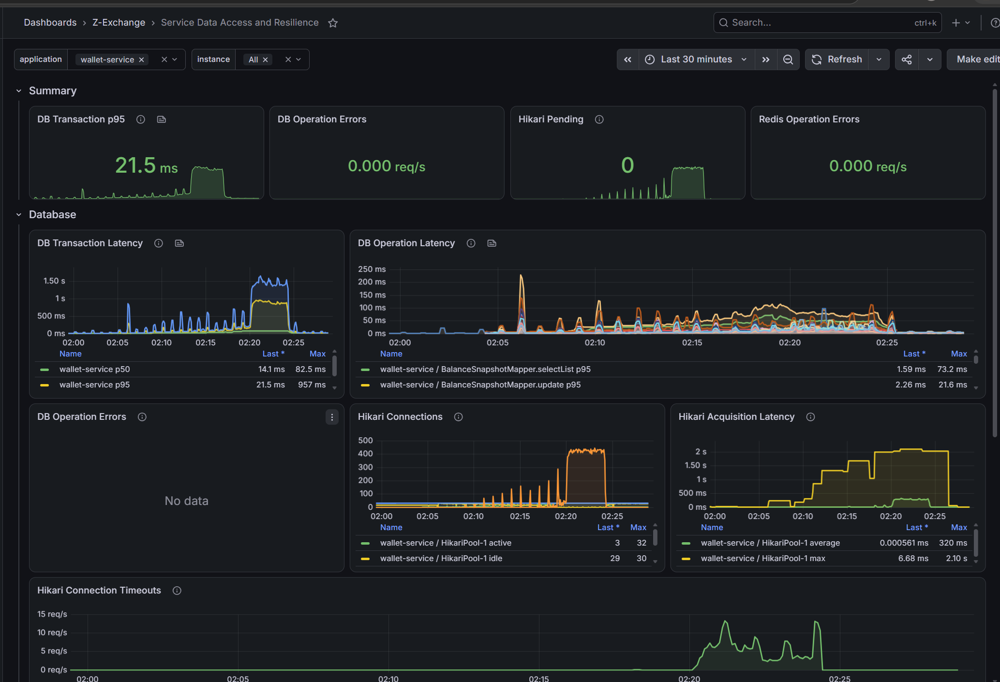

### How was it diagnosed?

1. Align the wallet-business, gRPC and database dashboards to the same 02:20–02:24 interval.
2. Identify the service limit: offered load continued to rise, but successful gRPC TPS stopped increasing while latency, active calls and errors grew.
3. Correlate the limit with Hikari. The pool reached 32 active connections, pending requests remained around 400+, acquisition latency approached the timeout, and connection timeouts appeared.
4. Separate execution from waiting. SQL-operation latency remained far below transaction and acquisition latency, so the dominant delay was waiting for a connection rather than recurrence of the original slow query.
5. Compare the two wallet flows. As gRPC concurrency grew, completion TPS fell to zero; both changed at the same time as pool saturation.
6. Observe the recovery intervention. When gRPC traffic stopped, the completion listener recovered immediately and processed about 140 TPS without a deployment or Kafka change.
7. Use the code configuration to explain the relationship: gRPC handlers and the three Kafka completion threads use the same wallet datasource and Hikari pool. The pool provides no reserved capacity for either workload.

### Where was the problem?

The immediate limit was the wallet service's shared database-access capacity. Many concurrent gRPC handlers and three Kafka completion threads competed for the same 32 Hikari connections. The larger population of gRPC requests could occupy the pool and leave the Kafka threads waiting for a loner time (there are more grpc business processing threads as competitors); once those three threads waited or timed out, successful completion TPS could fall to zero.

The gRPC plateau did not occur *because* completion reached zero. Both were effects of the same overload condition: all connections were busy, hundreds of callers were queued, and acquisition timeouts limited further progress. Fixed Kafka concurrency amplified the effect because blocking any of its three threads removed a large fraction of completion capacity.

This test confirms saturation of the wallet connection pool and the wallet-to-database access path. It does not, by itself, prove that the MySQL server reached its hardware or `max_connections=80` limit; that requires MySQL CPU, I/O, `Threads_connected`, active-session and lock-wait evidence. File-descriptor or Kafka-broker exhaustion is not supported as the primary explanation.

### Conclusion and next step

Increasing the wallet pool from 12 to 32 raised the saturation point but did not isolate critical Kafka completion work from foreground gRPC demand. Increasing the pool again could simply move the bottleneck into MySQL.

Keep the current pool and MySQL limits for the next experiment. Add a temporary gRPC concurrency cap—starting around 24–26 concurrent DB operations—to preserve headroom for the three Kafka consumers and background work. Then rerun the same load and verify:

- Hikari pending remains near zero and connection timeouts disappear;
- gRPC overload is handled through explicit backpressure rather than multi-second internal waits;
- completion TPS never collapses to zero and consumer lag remains bounded;
- MySQL CPU, I/O, active sessions, query latency and lock waits remain healthy.

Do not increase Kafka concurrency or the Hikari maximum independently: either change can increase database contention. If admission control is insufficient, reduce connection-holding time or evaluate explicit workload isolation. A separate consumer datasource should be considered only with careful transaction-manager design so wallet state and outbox guarantees remain correct.
