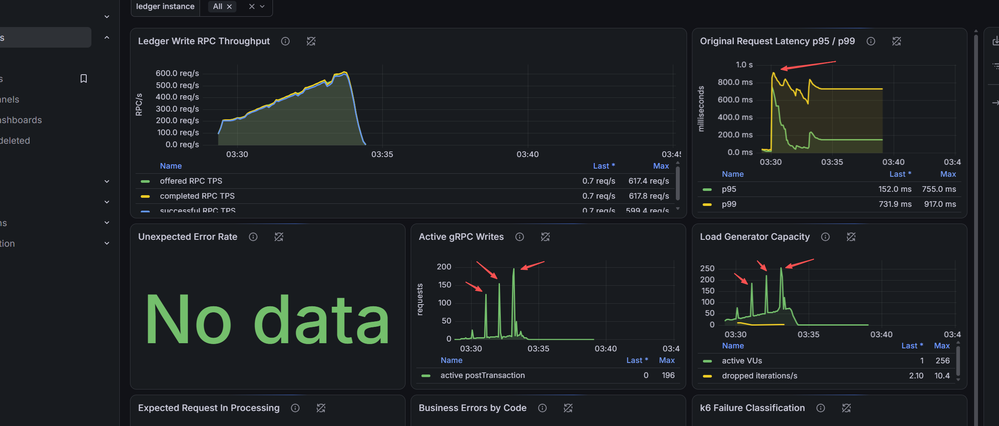

# Ledger Write Tail-Latency Analysis

## Run

Run ID: `discovery-20260801-02`

- Profile: `discovery`
- Initial rate: 200 logical transactions/s
- Rate increase: 50 logical transactions/s every 30 seconds
- Final target: 600 logical transactions/s
- Workload: distributed accounts with approximately 5% duplicate RPCs



## Observed Phenomenon

RPC throughput grows smoothly to approximately 617 RPC/s because
`ramping-arrival-rate` interpolates between each target. During the ramp:

- p95 and p99 rise sharply near the initial 200-250 RPC/s region.
- p95 subsequently falls quickly, while p99 remains elevated.
- Active gRPC writes and active k6 VUs show aligned spikes.
- k6 reports short bursts of dropped iterations.
- The terminal summary reports approximately 135 ms p95 and 650 ms p99, with
  no unexpected request errors and successful SQL reconciliation.

## Interpretation

p95 ignores the slowest 5% of requests, while p99 ignores only the slowest 1%.
After a temporary stall, normal requests can quickly reduce the slow proportion
below 5%, causing p95 to fall. If 1-5% of requests remain slow, p99 stays high.
The aligned active-request and VU spikes support transient request accumulation:

```text
temporary processing stall
  -> requests remain active
  -> k6 uses more VUs to preserve arrival rate
  -> iterations drop when no VU is immediately available
```

This indicates a bursty tail-latency problem rather than uniform slowdown or
sustained throughput collapse.

## Dashboard Caveats

The latency panel currently applies `max()` across tagged percentile series.
It therefore shows the worst subgroup, such as a 20-entry transaction group,
instead of an overall percentile calculated from all original requests.
Percentile gauges cannot be combined correctly with `max()`, `avg()`, or
`sum()`.

The flat latency line after traffic stops is also not ongoing request latency.
k6 does not emit stale markers by default, so Prometheus can retain the last
sample for approximately five minutes.

## Plausible Causes

These are hypotheses, not conclusions:

- MySQL transaction, flush, disk-I/O, or connection-pool stalls.
- JVM GC pauses or application executor queueing.
- Runtime VU allocation because 100 VUs were preallocated while the run used
  up to approximately 256.
- Higher latency concentrated in 20-entry transactions.
- EC2 CPU credits, EBS burst limits, or transient VPC/database latency.

## Follow-Up Validation

- Correlate each spike with JVM GC, DB transaction latency, Hikari pending
  connections, MySQL CPU/I/O/lock waits, and EC2 CPU-credit/EBS metrics.
- Use a native histogram or separate latency series by entry count instead of
  `max()` over percentile gauges.
- Enable `K6_PROMETHEUS_RW_STALE_MARKERS=true`.
- Preallocate about 320 VUs and repeat with a lower warm-up rate to distinguish
  cold-start effects from the actual capacity knee.
