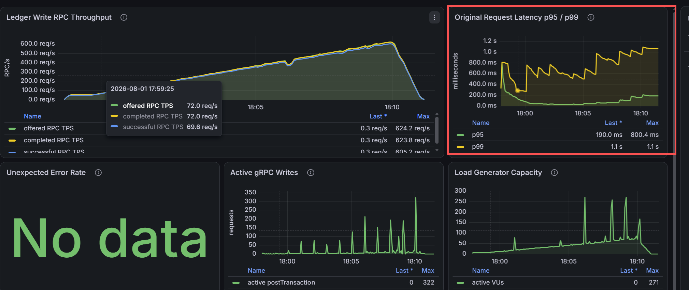
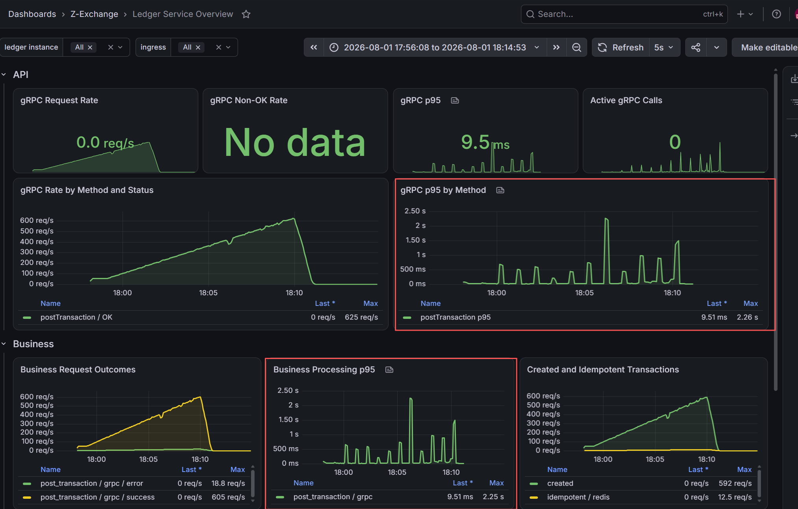

# Ledger Write Server-Latency Spike Analysis

## Scenario

Run ID: `discovery-20260801-03`

This run follows the recommendations from
`1.ledger-write-tail-latency-analysis.md`:

- Lower warm-up from 200 to 50 logical transactions/s.
- Increase each ramp stage from 30 to 60 seconds.
- Ramp by 50 transactions/s for 11 steps, ending near 600 transactions/s.
- Preallocate 320 k6 VUs instead of 100.

The run completed all load stages and reconciled the ledger with zero data
mismatches. The earlier tail-latency pattern remained visible despite the lower
starting rate and larger preallocated VU pool.

## Observed Phenomenon

- Throughput increases smoothly to approximately 625 RPC/s.
- Original-request latency ends near 163 ms p95 and 970 ms p99.
- gRPC p95 and business-processing p95 show matching narrow spikes, reaching
  approximately 2.26 seconds and 2.25 seconds respectively.
- Active gRPC requests and k6 VUs spike at corresponding times.
- All checks pass, unexpected error rate is zero, and SQL reconciliation passes.

## Interpretation

The matching gRPC and business spikes place most of the delay inside the ledger
business-processing path. Network and gRPC framework overhead are unlikely to
be the primary source. The aligned active-request and VU spikes indicate a
temporary server stall that allows requests to accumulate.

The k6 and server p95 values are not directly comparable. k6 selects the maximum
from tagged, original-request percentile series, while the server calculates a
rolling percentile from histogram buckets across all requests. The server's
large gap between the 1-second and 3-second buckets can also exaggerate the
estimated spike value.

## Possible Causes

These remain hypotheses until correlated metrics are available:

- MySQL commit, checkpoint, lock, connection-pool, or EBS I/O stalls.
- JVM stop-the-world GC pauses or executor saturation.
- Redis memory pressure, swapping, or AOF rewrite/fork activity. Memory growth
  alone is unlikely to cause abrupt spikes, but Redis and MySQL share the same
  infrastructure EC2 and storage resources.

## Follow-Up

Add correlated dashboard panels before the next discovery run:

- **DB:** transaction latency, Hikari active/pending connections, lock waits,
  MySQL log/fsync activity, and EC2 EBS latency/queue depth.
- **JVM:** GC pause duration, heap usage, allocation rate, process CPU, and
  executor queue/activity.
- **Redis:** client latency, used memory/RSS, evictions, blocked clients, and AOF
  rewrite/fork status.

Use a shared time axis so each gRPC/business spike can be matched directly to
DB, JVM, Redis, and infrastructure behavior.
