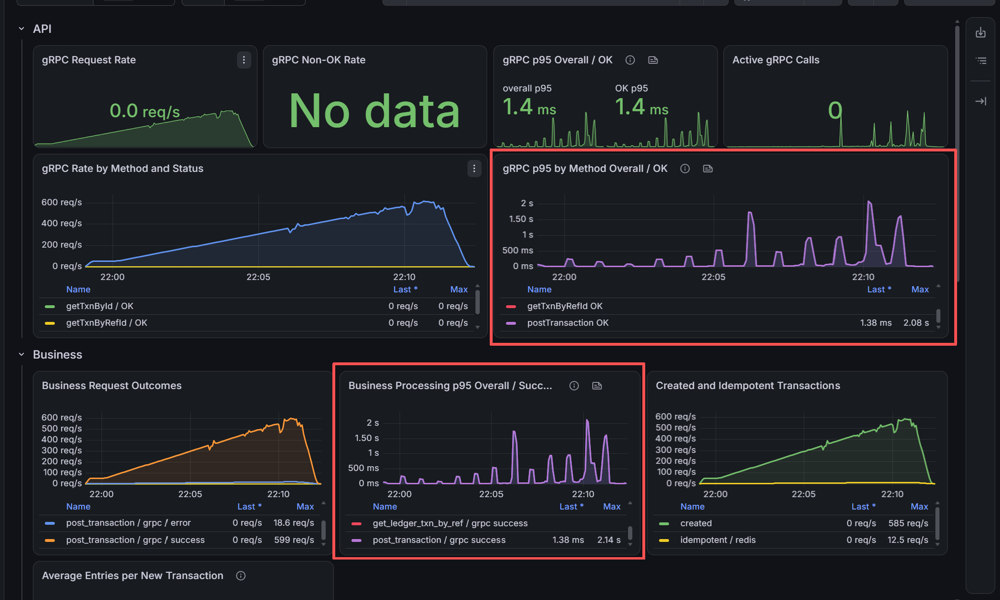
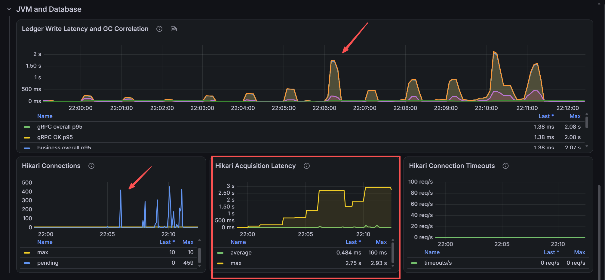
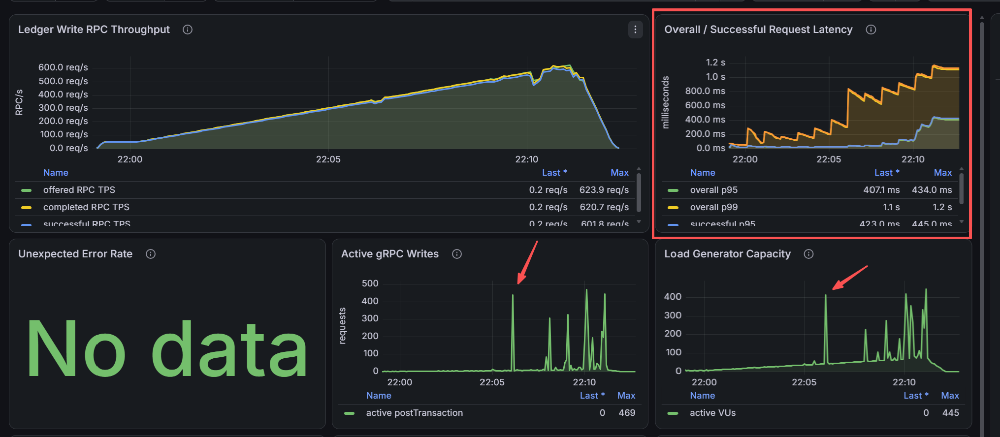
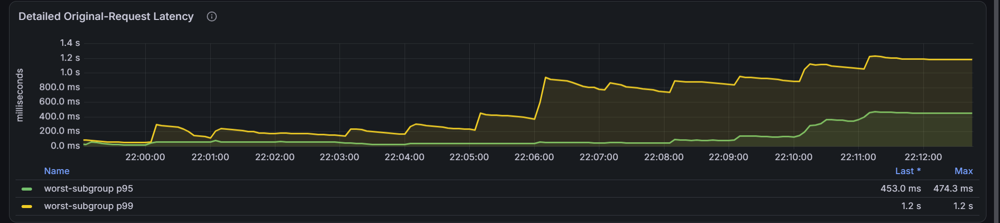

# Ledger Write Latency Observability Update

## Scenario

This discovery run validates the observability changes requested by
`2.ledger-write-server-latency-spike-analysis.md`:

- k6 reports aggregate overall and successful request p95/p99.
- Ledger metrics separate overall from successful gRPC, business, and DB
  transaction latency.
- JVM GC pauses and Hikari connection pressure share the same time axis.
- Ramp stages last 60 seconds and throughput rises smoothly to approximately
  624 RPC/s.

## Observed Phenomenon

- gRPC and business-processing p95 spike together, reaching approximately
  2.1 seconds.
- DB transaction p95 and GC pause remain low during the marked spikes.
- Hikari has a maximum of 10 connections, while pending borrowers reach 459.
- Hikari acquisition average reaches approximately 160 ms and its rolling
  maximum reaches 2.93 seconds; no acquisition timeout is recorded.
- Active gRPC writes reach 469 and k6 active VUs reach 445 at corresponding
  times, while offered traffic remains smooth.
- Aggregate and successful k6 latency remain close. Aggregate p95 reaches
  approximately 434 ms, versus 474 ms for the detailed worst-subgroup p95;
  both p99 views reach approximately 1.2 seconds.

## Interpretation

The dominant symptom is DB connection-pool queueing. At the observed maxima,
459 pending borrowers plus 10 pool connections account for the 469 active gRPC
writes. This is strong evidence that requests accumulate while waiting for a DB
connection.

Low DB transaction p95 does not exclude this wait. `postTransaction` queries
account references before entering `DbTxnExecutor`, so that query and its
connection acquisition are included in business/gRPC latency but excluded from
the DB transaction timer. A short stall affecting fewer than 5% of transactions
can also be hidden by DB p95.

The active-RPC and VU spikes are primarily consequences of the stall. The open
arrival-rate model activates more VUs to maintain smooth offered traffic, which
then amplifies the connection queue. GC is unlikely to be the primary cause.

The Hikari maximum is a rolling outlier signal and remains visible after a slow
acquisition; it does not mean every current acquisition takes several seconds.

## Possible Causes

- The 10-connection pool is too small for transient write concurrency.
- The account-reference lookup or another DB operation temporarily holds or
  waits for connections.
- MySQL, network, or storage stalls temporarily prevent connection reuse.
- Spikes appear near one-minute boundaries, but the 60-second ramp stages do
  not create abrupt traffic jumps or allocate a new DB pool. This correlation
  remains unproven until tested at a fixed arrival rate.

The evidence shows pool saturation, not inefficient Hikari allocation or reuse
by itself. Increasing the pool without checking MySQL capacity could move the
bottleneck into the database.

## Follow-Up

- Measure `AccountRepository.getAccountIdInRef` duration and add Hikari total,
  idle, and connection-usage latency.
- Run a fixed-rate soak where discovery produced spikes to verify whether the
  one-minute pattern remains.
- Compare pool sizes 10, 16, and 20 under the same fixed workload while
  monitoring MySQL CPU, I/O, running threads, and lock waits.
- Remove the detailed original-request Trend and panel. The aggregate
  overall/successful panel is more accurate for capacity analysis, and this run
  shows no material diagnostic benefit from the detailed worst-subgroup view.
- Run the recovery and soak profiles after selecting a justified pool size.
