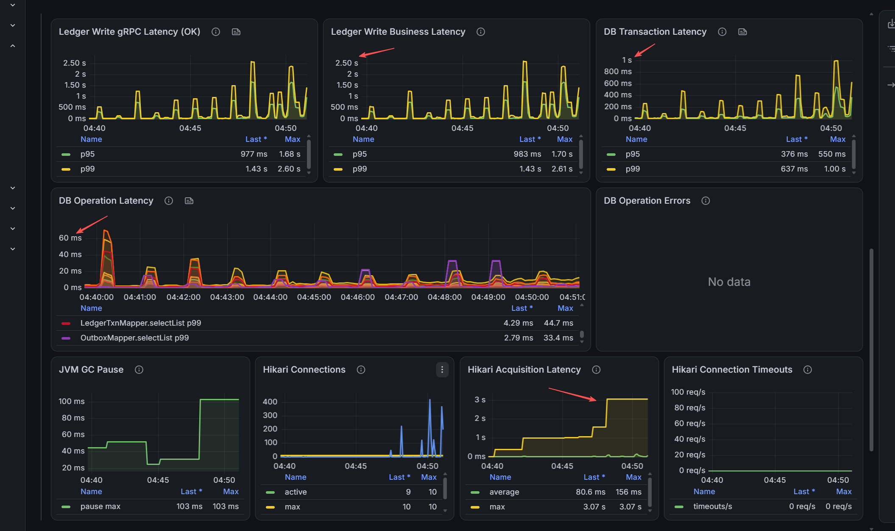
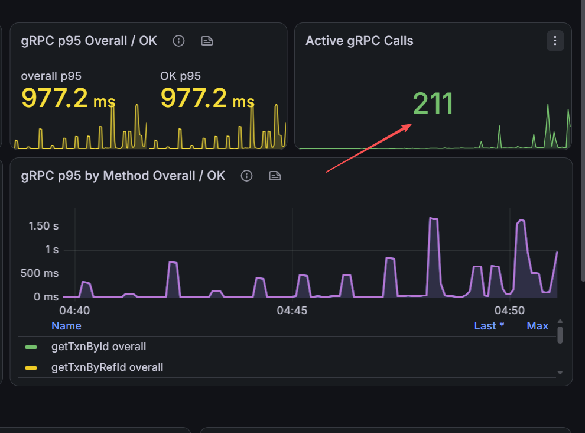

# Ledger Write DB Connection Pool Analysis

## Problem From The Previous Test

`3.ledger-write-latency-observability-update.md` found recurring gRPC and
business tail-latency spikes. Hikari had only 10 connections while pending
borrowers reached hundreds, but the available DB transaction metric did not
show which part of DB access was slow. The remaining question was whether time
was spent executing SQL or waiting around the transaction boundary.

## Diagnostic Improvement

- Added MyBatis statement timing close to JDBC execution, tagged by mapper
  method, command, and outcome.
- Kept DB transaction timing as the broader boundary that includes connection
  acquisition, transaction work, and commit.
- Split gRPC, business, DB transaction, DB operation, Hikari, and GC panels so
  their spikes can be compared on the same time axis.

## DB Transaction Versus DB Operation Latency

The **DB Transaction Latency** panel measures the complete `DbTxnExecutor`
callback. It includes obtaining a pooled connection, beginning the transaction,
all work inside the callback, and commit or rollback.

The **DB Operation Latency** panel measures each MyBatis
`StatementHandler.query/update/batch` call close to JDBC execution. It includes
statement execution and result handling, but excludes connection acquisition,
statement preparation, parameter binding, and transaction begin or commit.

The panels therefore answer different questions: transaction latency shows how
long the application occupies the transaction boundary, while operation
latency shows whether an individual SQL operation is slow. Their quantiles are
not additive, so transaction p99 minus operation p99 is not a valid acquisition
latency calculation; the curves must be correlated with Hikari metrics.

## Latest Stress-Test Evidence

- gRPC and business p99 reach approximately 2.60 seconds; their curves remain
  closely aligned.
- DB transaction p99 reaches approximately 1.00 second and spikes at the same
  periods.
- Individual DB operations remain in the tens of milliseconds. For example,
  the displayed `LedgerTxnMapper.selectList` p99 reaches 44.7 ms and
  `OutboxMapper.selectList` reaches 33.4 ms.
- The Hikari pool reaches its maximum of 10 active connections while pending
  borrowers spike above 400.
- Hikari acquisition average reaches approximately 156 ms and its rolling
  maximum reaches 3.07 seconds. No connection timeout is recorded.
- Active gRPC calls reach 211 in the highlighted view, showing request
  accumulation well above available DB concurrency.
- GC pause reaches 103 ms and no DB operation error is shown; neither explains
  the multi-second tail by itself.

## Interpretation And Possible Root Cause

The strongest current diagnosis is **DB connection-pool saturation**. SQL
execution is relatively short, while the broader transaction and connection
acquisition measurements are high. The immediate waiting point is therefore
connection acquisition rather than mapper statement execution.

The panel combination supports this conclusion:

- DB transaction p99 rises to approximately 1.00 second while individual
  operation p99 remains in the tens of milliseconds.
- Hikari active connections reach the configured maximum of 10 at the same
  high-load periods.
- Pending borrowers exceed 400, proving that many request threads are waiting
  for a connection rather than executing SQL.
- Acquisition average and rolling maximum rise to approximately 156 ms and
  3.07 seconds respectively, matching the missing wait outside operation
  timing.
- The DB operation error and Hikari timeout panels remain empty, so most queued
  requests eventually acquire a connection and complete.

Active gRPC calls exceeding the pool size is normal by itself. Combined with a
full pool, hundreds of pending borrowers, and high acquisition latency, it
shows that requests are queueing for connections.

This does not yet prove that the pool is simply too small. Possible underlying
causes are:

- The 10-connection pool is below useful MySQL concurrency.
- Transactions hold connections too long across multiple operations.
- Transaction begin or commit is slow; statement timing excludes both.
- MySQL, storage, or network stalls delay connection reuse.

Increasing the pool without validating MySQL capacity could only move the
bottleneck into the database.

## Next Steps

1. Run a fixed-rate baseline near the load where pending borrowers first rise;
   this separates pool behavior from the 60-second discovery ramps.
2. Compare pool sizes 10, 16, and 20 with identical workload and fixture data.
3. During each run, compare completed TPS, gRPC/business/transaction p95-p99,
   Hikari pending/acquisition/usage time, and MySQL CPU, I/O, running threads,
   connection count, and lock waits.
4. Accept a larger pool only if it reduces pending and tail latency while
   improving throughput without creating DB contention.
5. Run recovery and soak profiles using the justified pool size to verify that
   latency recovers and remains stable.
