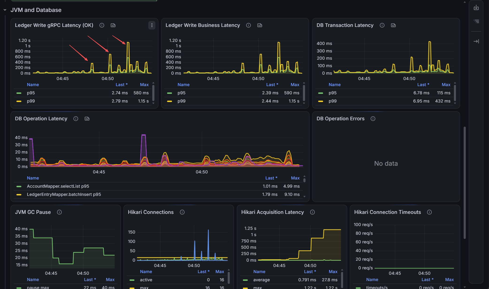
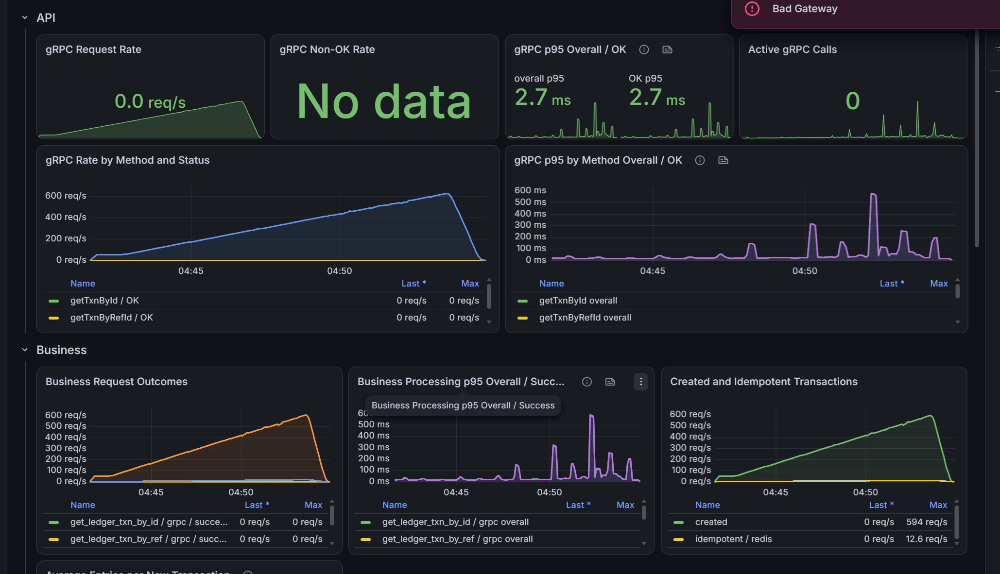

# Ledger Write Latency Stability Tuning

## Problem And Goal

`4.ledger-write-db-connection-pool-analysis.md` identified DB connection-pool
queueing as the main source of ledger write tail latency. The pool was limited
to 10 connections, pending borrowers exceeded 400, acquisition maximum reached
approximately 3.07 seconds, and gRPC/business p99 reached approximately 2.60
seconds.

This run evaluates whether a larger, prefilled pool and bounded client-side
timeouts reduce queueing without moving the bottleneck into SQL execution or
causing DB errors.

## Configuration Changes

- Increased the Hikari maximum pool size from 10 to 16 and fixed minimum idle
  at 16, keeping the full pool ready for spike traffic.
- Set connection acquisition and validation timeouts to 2 seconds and 1 second.
- Set connection maximum lifetime to 25 minutes and keepalive to 5 minutes.
- Set MySQL connect/socket timeouts to 2 seconds and 5 seconds.
- Set the MyBatis-Plus per-statement timeout to 3 seconds.
- Bounded service and infrastructure container memory, MySQL buffer-pool size,
  Kafka heap, Redis cache memory, and Prometheus retention. These controls reduce
  host-level interference, although this run does not isolate their individual
  effects.

## Latest Stress-Test Evidence

## Observed Result

- Throughput rises smoothly to approximately 600 RPC/s with no displayed gRPC
  non-OK rate or Hikari connection timeout.
- Between spikes, gRPC and business latency return to a low baseline.
- The first marked p99 spike is approximately 400 ms near 330 RPC/s, the second
  approximately 800 ms near 430 RPC/s, and the third approximately 1.2 seconds
  near 530 RPC/s.
- DB transaction p99 peaks near 432 ms, while individual DB operation latency
  remains in the millisecond-to-tens-of-milliseconds range.
- Hikari reaches all 16 active connections. Pending borrowers still spike, but
  peak near 160 rather than above 400.
- Hikari acquisition average peaks near 27.8 ms and its rolling maximum near
  1.22 seconds; the idle baseline remains below 1 ms.
- GC pause remains at approximately 15-40 ms and does not explain the larger
  tail-latency spikes.

Compared with the previous run, gRPC/business p99 falls from approximately 2.60
seconds to 1.15 seconds, acquisition maximum falls from 3.07 to 1.22 seconds,
and pending connection pressure is substantially reduced. The tuning therefore
improves both latency and stability.

## Interpretation

The remaining spikes still originate primarily from transient connection-pool
queueing. DB transaction latency and acquisition latency rise with gRPC and
business latency, while individual SQL operations remain relatively short.

Queueing begins to become visible around 330 RPC/s, but that is not necessarily
the server's hard saturation point. Each spike is followed by recovery, offered
throughput continues to produce matching successful throughput, and no timeout
rate appears. This means the pool is briefly saturated during higher-load
stages, but the system still drains the queue.

The increasing p99 values should therefore be interpreted against a latency
SLO:

| Requirement | Provisional boundary |
|---|---:|
| p99 below 500 ms | approximately 330 RPC/s |
| p99 below 1 second | approximately 430 RPC/s |
| Hard throughput saturation | not established in this run |

The apparent proportional relationship between load and spike height is not
enough to define capacity. Hard saturation requires sustained evidence such as
completed TPS plateauing below offered TPS, persistent pending connections,
continuously rising latency at a constant rate, dropped iterations, or errors.

## Next Steps

1. Hold 300, 350, 400, 450, 500, 550, and 600 RPC/s for two minutes each.
2. Exclude the first 10-15 seconds after each transition so stage-change bursts
   do not determine the result.
3. Accept a rate as sustainable only when completed TPS follows offered TPS,
   dropped iterations and unexpected errors remain zero, p99 reaches a stable
   plateau, and Hikari pending returns to zero.
4. Select the production operating rate from the required p99 SLO, then run the
   recovery and soak profiles at that rate.
