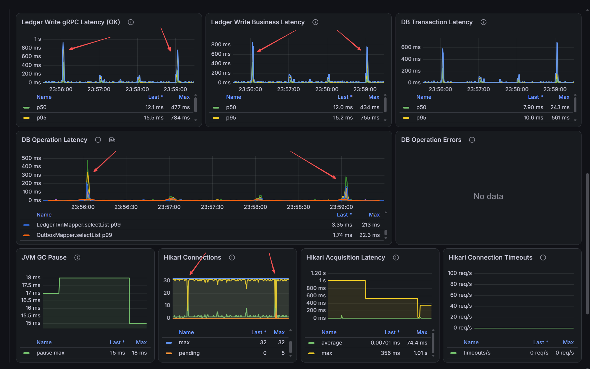
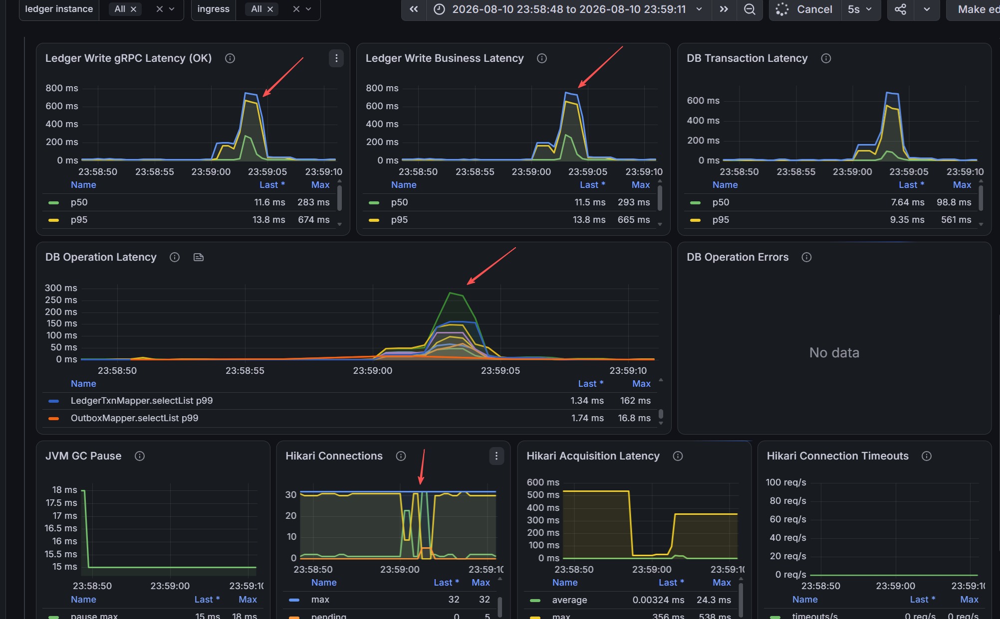
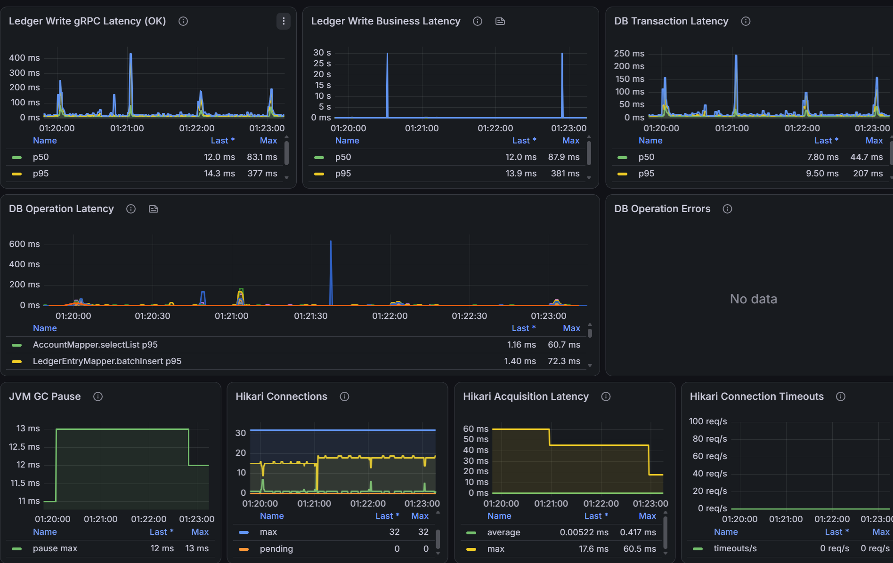

# Ledger Write Periodic DB Stall Analysis

## Problem From The Previous Test

`5.ledger-write-latency-stability-tuning.md` showed lower and more stable
latency after pool and timeout tuning, but short latency spikes remained under
a steady write rate. The unresolved questions were whether most requests or
only the tail slowed, whether the pool actually exhausted, and why the event
recurred near one-minute boundaries.

## Diagnostic Improvements

- Added p50 beside p95/p99 for gRPC, business, and DB transaction latency.
- Added Hikari total, idle, and pending gauges beside active and maximum.
- Changed ledger Prometheus scraping and the Grafana datasource interval from
  5 seconds to 500 ms for this diagnostic run.
- Narrowed the dashboard time range to compare DB statement execution, the
  transaction boundary, acquisition latency, and pool state during each event.

## Latest Evidence





- Throughput is normally stable near 127 requests/s and recovers after each
  short event; no DB operation error or Hikari timeout is recorded.
- During the focused event, gRPC/business p50 rises above 280 ms and p95 rises
  above 650 ms, so the slowdown briefly affects most requests.
- DB operation and transaction latency rise together, proving that SQL/JDBC
  execution slows independently of connection acquisition.
- Hikari idle connections collapse, pending borrowers reach 5, and acquisition
  latency rises while the pool is at its 32-connection limit.
- Completed request rate falls during the stall and briefly catches up after
  the queue drains.

### Timer Isolation Run



The `refresh-policy-routes@ens5.timer` candidate was stopped and the test was
repeated at 75 RPC/s. Periodic gRPC, business, transaction, and DB-operation
spikes remained. This excludes that timer only if it was disabled and verified
on both the ledger and infrastructure hosts.

This run does not show connection-pool saturation: Hikari pending stays at
zero, idle connections remain available, average acquisition latency stays
below 1 ms, and no acquisition timeout occurs. The pool therefore amplified
earlier high-load stalls but is not the initiating cause of the low-load
periodic events.

Two business-latency points near 30 seconds have no corresponding gRPC spike.
Because gRPC duration encloses business processing, those points cannot
represent the same completed request path and should be treated as a
histogram-query or dashboard artifact until confirmed by k6.

## Current Conclusion

The service and database are not continuously saturated. At high load, a short
DB-side stall can hold connections and temporarily exhaust Hikari, amplifying
the original delay:

```text
DB or storage slowdown
-> longer SQL and transaction duration
-> idle connections exhausted
-> pending borrowers and acquisition delay
-> gRPC/business latency spike
-> recovery and queue drain
```

At 75 RPC/s, however, the event occurs without pool queueing. Hikari is thus a
secondary amplifier rather than the root cause. Increasing minimum idle or the
maximum pool size is not justified by this evidence.

The route-policy timer does not explain the cadence if it was stopped on both
hosts. Remaining candidates are another periodic host/MySQL task, storage or
network interference, and distortion from calculating histogram quantiles over
a very short rate window. The 500 ms scrape interval is useful for Hikari
gauges, but latency histograms should use a longer fixed query window.

## Next Steps

1. Confirm the route timer is disabled on both hosts and inspect all remaining
   system timers with `systemctl list-timers --all`.
2. Compare exact spike timestamps with k6 latency. A server-only spike suggests
   a metric/query issue rather than user-visible latency.
3. Recalculate histogram quantiles over a fixed 10-15 second rate window while
   retaining 500 ms scraping for Hikari gauges.
4. Run persistent `SELECT 1` probes locally on the DB host and remotely from
   the ledger host to separate MySQL/storage delay from network delay.
5. Correlate another run with MySQL, EBS, CPU-steal, and `iostat -xz 1` data.
6. Keep the current pool limits until the initiating event is identified.
